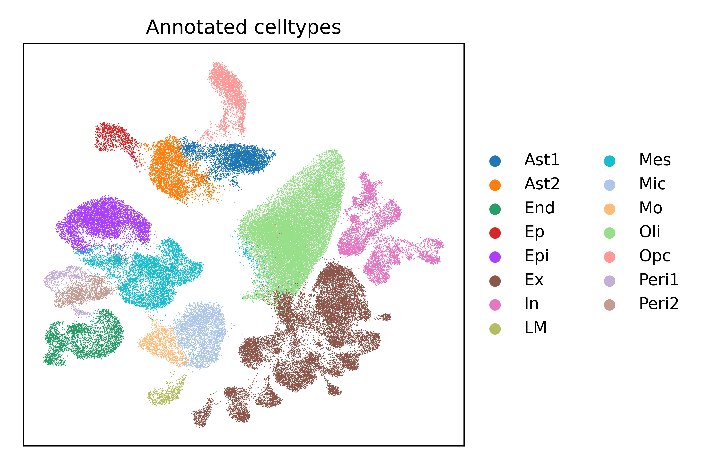

# Single-nucleus transcriptome analysis of human brain immune response in patients with severe COVID-19
### by John F. Fullard, Hao-Chih Lee, Georgios Voloudakis, Shengbao Suo, Behnam Javidfar, Zhiping Shao, Cyril Peter, Wen Zhang, Shan Jiang, André Corvelo, Heather Wargnier, Emma Woodoff-Leith, Dushyant P. Purohit, Sadhna Ahuja, Nadejda M. Tsankova, Nathalie Jette, Gabriel E. Hoffman, Schahram Akbarian, Mary Fowkes, John F. Crary, Guo-Cheng Yuan, Panos Roussos

This is the code repository for "Single-nucleus transcriptome analysis of human brain immune response in patients with severe COVID-19".
preprint is available at [bioaxiv](https://www.biorxiv.org/content/10.1101/2021.01.08.425999v1)

## Abstract
### Background: 
Coronavirus disease 2019 (COVID-19), caused by severe acute respiratory syndrome coronavirus 2 (SARS-CoV-2) infection, has been associated with neurological and neuropsychiatric illness in many individuals. We sought to further our understanding of the relationship between brain tropism, neuro-inflammation and host immune response in acute COVID-19 cases.

### Methods: 
3 brain regions (dorsolateral prefrontal cortex, medulla oblongata and choroid plexus) from 5 patients with severe COVID-19 and 4 controls were examined. The presence of virus was assessed by western blot against viral spike protein, as well as viral transcriptome analysis covering >99% of SARS-CoV-2 genome and all potential serotypes. Droplet-based single-nucleus RNA sequencing (snRNA-seq) was performed in the same samples to examine the impact of COVID-19 on transcription in individual cells of the brain.

### Results: 
Quantification of viral spike S1 protein and viral transcripts did not detect SARS-CoV-2 in the postmortem brain tissue. However, analysis of 68,557 single-nucleus transcriptomes from three distinct regions of the brain identified an increased proportion of stromal cells, monocytes and macrophages in the choroid plexus of COVID-19 patients. Furthermore, differential gene expression, pseudo-temporal trajectory and gene regulatory network analyses revealed transcriptional changes in cortical microglia associated with a range of biological processes, including cellular activation, mobility and phagocytosis. 

### Conclusions: 
Despite the absence of detectable SARS-CoV-2 in the brain at time of death, the findings suggest significant and persistent neuroinflammation in patients with acute COVID-19.

If you find this code useful in your research, please consider citing:

> @article {Fullard2021,
author = {John F. Fullard, Hao-Chih Lee, Georgios Voloudakis, Shengbao Suo, Behnam Javidfar, Zhiping Shao, Cyril Peter, Wen Zhang, Shan Jiang, André Corvelo, Heather Wargnier, Emma Woodoff-Leith, Dushyant P. Purohit, Sadhna Ahuja, Nadejda M. Tsankova, Nathalie Jette, Gabriel E. Hoffman, Schahram Akbarian, Mary Fowkes, John F. Crary, Guo-Cheng Yuan and Panos Roussos},
	title = {Single-nucleus transcriptome analysis of human brain immune response in patients with severe COVID-19},
	year = {2021},
	journal = {under review}
}

